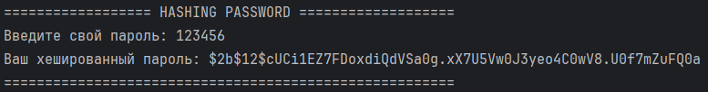
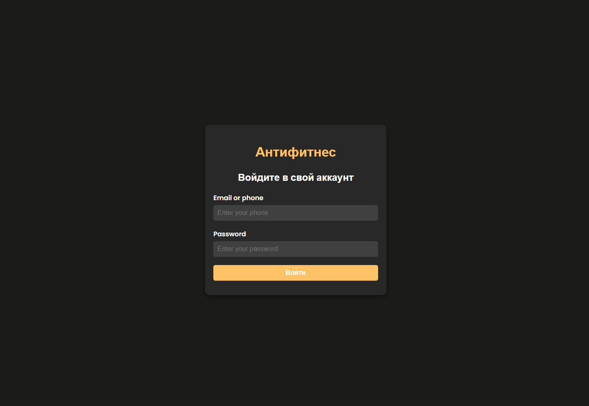
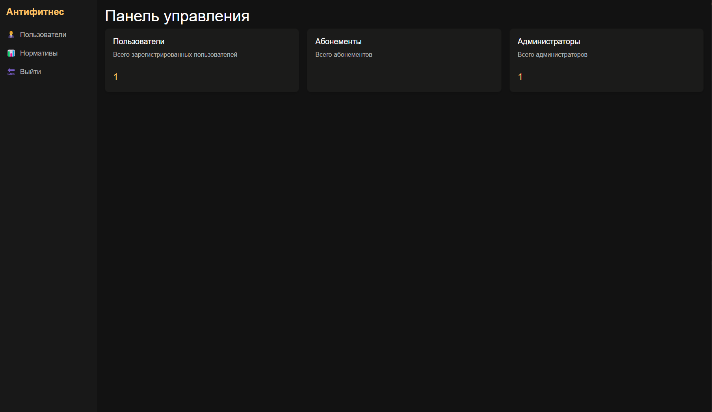

# Антифитнес

## Описание
Телеграмм бот с интеграцией CRM системы Fitbase.

## Стек технологий
 - Языки программирования: Python, JS, HTML&CSS
 - Фреймворки: FastAPI, Asyncio, SQLAlchemy, Alembic
 - База данных: PostgreSQL
 - Другие технологии: Git

## Установка
Чтобы запустить данный проект на своем локальном компьютере, выполните следующие шаги.

1. Скопируйте проект.
```bash
git clone https://github.com/ivalukyan/fitbase.git
```

2. Перейдите в папку с проектом.
```bash
cd fitbase
```

3. Если у вас не установлен Docker, то установите.
### Linux
Настройка репозитория.
```bash
# Add Docker's official GPG key:
sudo apt-get update
sudo apt-get install ca-certificates curl
sudo install -m 0755 -d /etc/apt/keyrings
sudo curl -fsSL https://download.docker.com/linux/ubuntu/gpg -o /etc/apt/keyrings/docker.asc
sudo chmod a+r /etc/apt/keyrings/docker.asc

# Add the repository to Apt sources:
echo \
  "deb [arch=$(dpkg --print-architecture) signed-by=/etc/apt/keyrings/docker.asc] https://download.docker.com/linux/ubuntu \
  $(. /etc/os-release && echo "$VERSION_CODENAME") stable" | \
  sudo tee /etc/apt/sources.list.d/docker.list > /dev/null
sudo apt-get update
```

Установка.
```bash
sudo apt-get install docker-ce docker-ce-cli containerd.io docker-buildx-plugin docker-compose-plugin
```

4. Запуск docker-compose.
```bash
docker compose -f ./docker/docker-compose.yml up -d --build
```

5. Затем для настроим базу данных. Хешируем ваш пароль. С начала установим библиотеку для хеширования.
### Linux
```bash
sudo apt install python3-pip
```

Затем.
```bash
pip3 install bcrypt
```

6. Перейдем в папку с программой.
```bash
сd src; cd utils
```

7. Запустим программу.
```bash
python3 hashing.py
```

8. Введем придуманный пароль для администратора. И нажмем enter, после чего получаем вот такой результат.
### Пример работы программы


9. Затем настроим базу данных. Перейдем в контейнер docker-compose БД.
```bash
docker exec -it postgres_db bash
```

10. Перейдем в консоль БД. Вместо postgres укажите реальный username.
```bash
psql -U postgres -d fitbase
```

11. Создадим все таблицы.
```bash
CREATE TABLE admins (
    id SERIAL PRIMARY KEY,
    username VARCHAR NOT NULL,
    phone VARCHAR NOT NULL,
    email VARCHAR,
    password VARCHAR NOT NULL,
    telegram_id BIGINT NOT NULL
);

CREATE TABLE users (
    id SERIAL PRIMARY KEY,
    username VARCHAR NOT NULL,
    phone VARCHAR NOT NULL,
    email VARCHAR,
    telegram_id BIGINT NOT NULL
);

CREATE TABLE standards (
    id SERIAL PRIMARY KEY,
    telegram_id BIGINT,
    username VARCHAR,
    grom VARCHAR DEFAULT '00:00',
    turkish_barbell_lifting INTEGER DEFAULT 0,
    jump_rope INTEGER DEFAULT 0,
    bench_press INTEGER DEFAULT 0,
    rod_length INTEGER DEFAULT 0,
    shuttle_run INTEGER DEFAULT 0,
    glute_bridge INTEGER DEFAULT 0,
    pull_ups INTEGER DEFAULT 0,
    cubic_jumps INTEGER DEFAULT 0,
    lifting_barbell_on_the_chest_count INTEGER DEFAULT 0,
    axel_deadlift INTEGER DEFAULT 0,
    handstand VARCHAR DEFAULT '00:00',
    classic_squat INTEGER DEFAULT 0,
    turkish_kettlebell_lifting INTEGER DEFAULT 0,
    push_ups INTEGER DEFAULT 0,
    lifting_barbell_on_the_chest_kilo INTEGER DEFAULT 0,
    walking_kettlebells INTEGER DEFAULT 0,
    deadlift INTEGER DEFAULT 0,
    long_jump INTEGER DEFAULT 0,
    barbell_jerk INTEGER DEFAULT 0,
    axel_hold VARCHAR DEFAULT '00:00',
    front_squat INTEGER DEFAULT 0
);
```

12. Создадим администратора. Не забудьте поменять на свои данные.
```bash
INSERT INTO admins (username, phone, email, password, telegram_id)
VALUES ('username', '79XXXXXXXXX', 'example@gmail.com', 'ваш хешированный пароль', 239439893);
```

13. После этого можно заходить и запускать бота командой `/start`, администратор `/admin`.

## Пример работы программы


